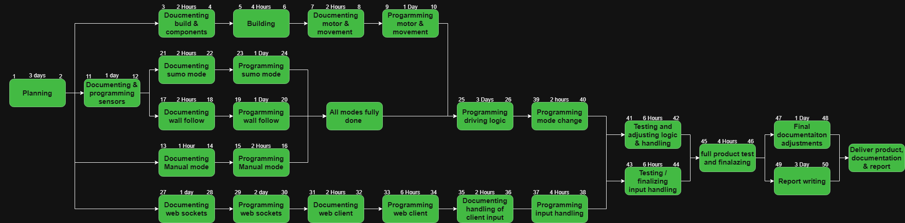
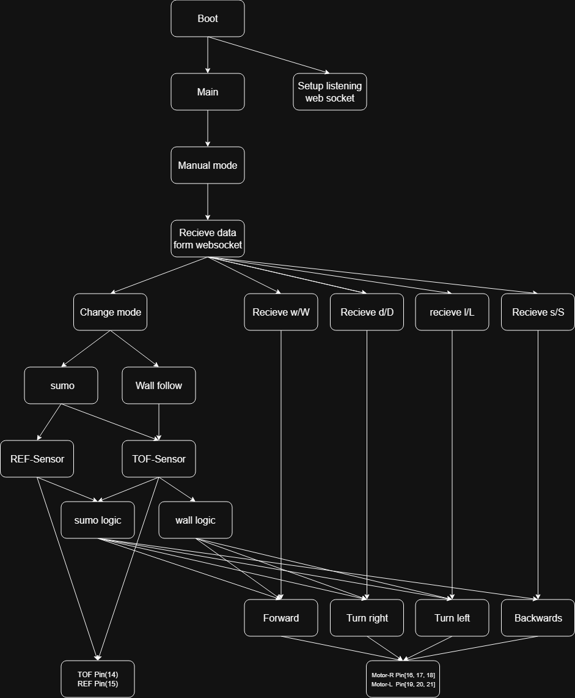

# Components used to for the build
## Main electrical components
2 x 6v DC Motors  
1 x GY-53 Time of flight sensor  
1 x QRE1113 (analog) IR reflection sensor  
1 x Raspberry pico W  
1 x L298 H-bridge  
1 x Battery 7,4V  
1 x Breakout board for RP pico

## Other misc components
Wires  
Ways to fasten everything   
Wheels   
Swich for turning on and off  
Base for the car

# Diagrams for the project

## WBS Diagram 

## Network Diagram

## Modul Structure 

## Wire Diagram

## Block Diagram

